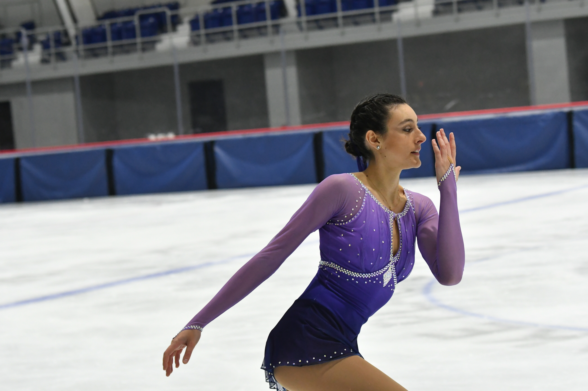
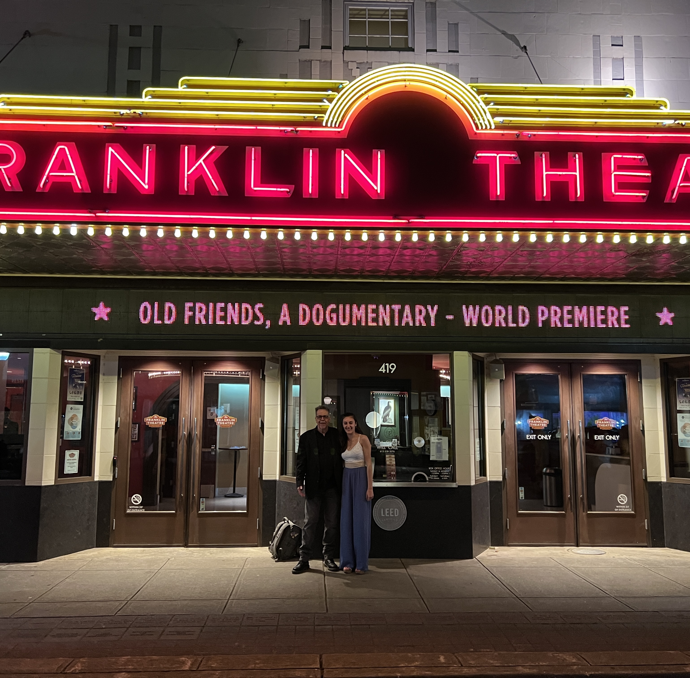
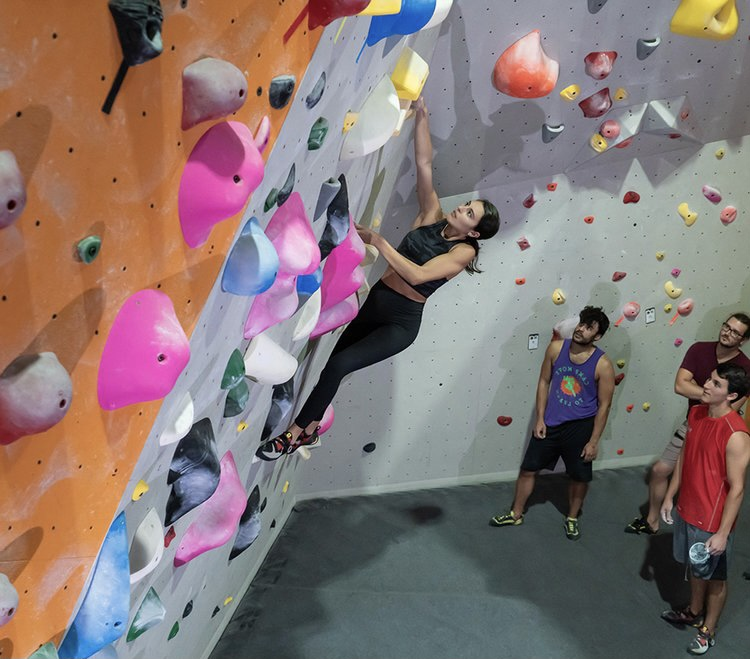

I want to use this page to give those curious a more three dimensional idea of who I am, both professionally and outside of work.

---

## Editing Career
### The Beginning
I started editing when I was 14 years old. On my iPhone, of course. My cousins and I would make movies, and I would always insist on being director, cinematographer, and editor while everyone else acted. I became obsessed with cutting clips to music and making transitions. From there I started my YouTube page, HeartofNarnia, as well as my Instagram, NarniaHeroes, where I would edit Narnia scenes to music. My goal has always been the same: to make people feel something. People started falling in love with my videos. Narnia fans from all over the world would leave me messages about how much my videos mean to them. I grew very quickly. Within a year, I had a couple thousand followers, and today, though I don't have much time to post anymore, I still have 23,000 on Instagram and 19,000 on YouTube.

### University & My first editing job
I studied Media Production at Western Connecticut State University. My freshman year I was already shooting videos and making short films for Basic Video Production classes. That year I won my first award for the best video in Basic Video Production in the University BEA Club Film Festival. The following year I also won first place for best Spec Spot, I created a commercial for Riedell Figure Skates. Junior year, I participated in WCSU's Election Connection, which is live studio election & news coverage. My role that year was Technical Director / Remote Feed, where I handled, in live time, the feed of our student reporters out in the field. That year, my self written, directed, and edited short documentary won Best in Festival as well as Best Documentary. Senior year, I participated in Election Connection again. This time, I got to be the Video Producer, where I created visuals that were displayed throughout the show each week. I also worked as an audio technician during live time. Our work in election connection won us an Emmy in the National Academy Of Television Arts & Sciences / New England (THE EMMY). We came in second place for newscast, and my personal trailer won an honorable mention as well. For my senior project, I created a documentary about C.S. Lewis, and his impact on the world. I got my YouTube and Instagram fans from all over the world to participate. Due to my status in the Narnia world, I was able to get in contact with C.S. Lewis' stepson to do an interview, as well as two of the actors from the films. It was very special to me. I won best documentary and Best in Show that year as well. 

My Junior year was when I met filmmaker Gorman Bechard. He came to WCSU to show his documentary, Pizza: A Love Story. We met afterwards and he was quick to ask me to be his intern. I was his intern for two months and he hired me immediately after. I've been editing documentaries for him ever since.

*Gorman and I in front of the Franklin Theater in Nashville, TN for the debut of Old Friends*

### Professional Summary
I specialize in documentaries - both short and feature length. I edited my first feature length film with Gorman in less than a year. I am experienced in being thrown 10TB+ footage and cutting it down to a 2 hour film without any involvement in the production process. I do go on the set when Gorman wants my help. I have done both audio and video recording for our films. I am a fast paced editor yet an unwavering perfectionist. I specialize in trailers and creating my own transitions, but can edit anything thrown my way. I'm fantastic with B-Roll and making everything visually beautiful and emotional. I'm very familiar with color grading, music editing, adding subtitles, cleaning up audio, cleaning everything up generally, whether it's cutting it down or adding more substance. What has driven me from the beginning is my passion for storytelling - making people feel emotion throughout the video. Besides Gorman I have edited for several other independent filmmakers on various different projects. I've edited feature length films, short films, trailers, commercials, music videos, previews, TV Episodes, TV music features, and film festivals. A full list of my works are on my portfolio page.

## Outside of Editing
### Figure Skating

### Rock Climbing

### Writings